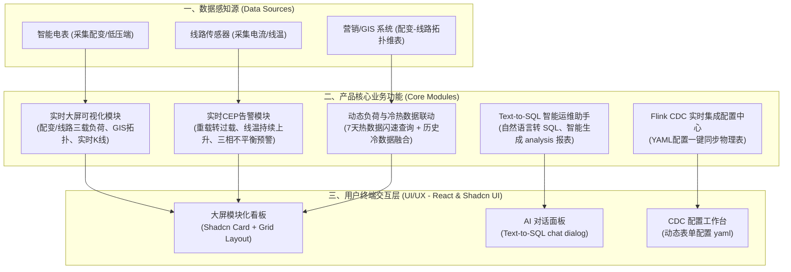

# 国家电网配变与线路状态实时监测平台——产品架构设计说明书

> **文档状态**：发布版 (v1.0.0)  
> **面向对象**：产品经理、系统架构师、前端开发、业务决策者  
> **核心目标**：构建一个能够实时感知配电网健康状态、异常隐患秒级告警、数据自助智能运营的下一代电网监控平台。

---

## 一、 产品定位与背景

国家电网配电网作为电力供应的“最后一公里”，包含大量的配电变压器（配变）和输电线路。在用电高峰期，配变及线路的**轻载、重载、过载**（简称“三载”）状态，以及电压异常波动、断相、三相不平衡等情况频繁发生。

传统的监控模式依赖批处理或小时级汇总，无法做到秒级状态感知，导致：
1. **设备烧毁**：持续过载未能及时减负荷，导致配变烧毁。
2. **用电投诉**：电压异常（过压/欠压）造成居民用电质量下降或电器损坏。
3. **运维被动**：故障发生后才被动抢修，缺乏基于复杂事件流（Flink CEP）的趋势预测与主动预警。

本产品致力于利用 **Fluss 实时变更数据湖仓** 与 **StarRocks 极速分析引擎**，打通底层物联网采集到前端大屏的可视化通道，并引入 **AI 大模型 Text-to-SQL** 降低非技术人员的即席查询门槛，实现电网状态“看得见、报得准、管得精”。

---

## 二、 产品整体架构蓝图



---

## 三、 核心产品模块深度解析

### 1. 实时大屏与监控模块 (Real-time Dashboard)
*   **配变负荷状态追踪**：对配电变压器按“轻载（负载率 < 20%）”、“合理（20%~80%）”、“重载（80%~100%）”、“过载（> 100%）”进行动态分级着色。
*   **线路三载监测**：展示主干网及分支线路电流热力图，识别瓶颈路段。
*   **多维时序分析**：结合累计窗口（CUMULATE Window），提供当天各整点配变负载率累计走势，辅助电力调配。

### 2. 复杂事件告警模块 (CEP Alert Engine)
*   **非突发持续性异常告警**：通过 Flink CEP 捕获“**重载转过载且持续超15分钟**”或“**三相不平衡度持续扩大**”等链式隐患。
*   **多源Retraction流式修正**：当数据发生重测、重传或历史变更时，告警引擎能够自动撤回已发送的虚假告警或对告警状态进行更新。

### 3. Flink CDC YAML 化配置中心 (YAML-based CDC Sync)
*   **免编译/免写SQL**：为业务运维人员提供统一的配置入口。
*   **低代码同步**：只需填入源端 MySQL/PG 和目标端 Fluss/StarRocks 的连接参数与映射规则，系统自动转化为底层 Flink 任务并提交。
*   **典型 YAML 配置范式**：
    ```yaml
    job:
      name: "stategrid-dwd-sync-meter"
      source:
        type: "postgres-cdc"
        hosts: "localhost:5432"
        database: "stategrid"
        table: "device_meter_readings"
      sink:
        type: "fluss"
        table: "dwd.meter_readings_changelog"
      schema:
        mapping:
          - source: "device_id"
            target: "meter_id"
            type: "BIGINT"
          - source: "current_a"
            target: "ua_curr"
            type: "DOUBLE"
    ```

### 4. Text-to-SQL 智能运维助手 (Text-to-SQL Assistant)
*   **自然语言即席查询**：运行维护人员只需在界面中输入“帮我查一下昨天下午2点到4点，江宁区过载时间最长的前5台变压器”，系统将生成准确的 StarRocks SQL 并执行，生成图表渲染。
*   **数据安全沙箱**：基于 LLM 生成的 SQL 会经过解析器校验，仅允许执行 `SELECT` 语句，并对敏感设备 ID 进行脱敏处理。

---

## 四、 交互与界面设计 (React & Shadcn UI 规范)

为了满足大屏的高性能渲染与管理后台的高效模块化，前端建议采用 **React 18**、**TypeScript** 以及 **Shadcn UI** 组件库。

### 1. 整体布局架构 (Layout)
*   采用 `Grid` 网格布局。大屏主视图分为：
    *   **Top Header**：显示全网今日累计负载、今日预警总数。
    *   **Left Pane**：配变/线路负载率统计图表（利用 Recharts / ECharts 渲染）。
    *   **Center Area**：GIS 低压配电拓扑图，直观标记过载变压器。
    *   **Right Pane**：实时 CEP 异常告警滚动流（使用 Shadcn UI `Table` / `ScrollArea`）。
    *   **Bottom Pane**：今日负荷峰谷趋势图（24小时累计 CUMULATE 窗口视图）。

### 2. 核心界面组件设计 (Carousels)

````carousel
```tsx
// 1. 实时告警卡片组件 (AlertCard.tsx)
import * as React from "react"
import { AlertCircle } from "lucide-react"
import { Card, CardHeader, CardTitle, CardContent } from "@/components/ui/card"

export function AlertCard({ deviceId, duration, value }) {
  return (
    <Card className="border-red-500 bg-red-950/20 text-white animate-pulse">
      <CardHeader className="flex flex-row items-center justify-between space-y-0 pb-2">
        <CardTitle className="text-sm font-medium flex items-center gap-2">
          <AlertCircle className="h-4 w-4 text-red-500" />
          设备异常告警
        </CardTitle>
        <span className="text-xs text-red-400 font-semibold px-2 py-0.5 rounded-full bg-red-950">
          过载
        </span>
      </CardHeader>
      <CardContent>
        <div className="text-2xl font-bold">{deviceId}</div>
        <p className="text-xs text-muted-foreground mt-1">
          负载率已达 <span className="text-red-400 font-bold">{value}%</span>，持续 {duration} 分钟
        </p>
      </CardContent>
    </Card>
  )
}
```
<!-- slide -->
```tsx
// 2. Text-to-SQL 助手交互面板 (SQLAssistant.tsx)
import * as React from "react"
import { Button } from "@/components/ui/button"
import { Textarea } from "@/components/ui/textarea"
import { ScrollArea } from "@/components/ui/scroll-area"

export function SQLAssistant() {
  const [query, setQuery] = React.useState("")
  const [messages, setMessages] = React.useState([
    { role: "assistant", content: "你好，我是国网智能运维助手。请输入你想查询的数据需求，例如：'分析今天早上有哪些变压器电流突增超50%'" }
  ])

  const handleSend = () => {
    setMessages(prev => [...prev, { role: "user", content: query }])
    setTimeout(() => {
      setMessages(prev => [...prev, { 
        role: "assistant", 
        content: "已为您生成 SQL:\n```sql\nSELECT meter_id, MAX(ua_curr) \nFROM fluss_dwd_meter_readings \nWHERE op_time >= TODAY() \nGROUP BY meter_id\n```\n正在为您执行并渲染图表..." 
      }])
    }, 1500)
    setQuery("")
  }

  return (
    <div className="flex flex-col h-[400px] border rounded-lg bg-background p-4">
      <ScrollArea className="flex-1 pr-4">
        {messages.map((m, i) => (
          <div key={i} className={`mb-3 p-3 rounded-lg max-w-[85%] ${m.role === 'user' ? 'bg-primary text-primary-foreground ml-auto' : 'bg-muted text-muted-foreground'}`}>
            <p className="text-sm whitespace-pre-wrap">{m.content}</p>
          </div>
        ))}
      </ScrollArea>
      <div className="flex gap-2 mt-4">
        <Textarea value={query} onChange={e => setQuery(e.target.value)} placeholder="输入自然语言需求..." className="resize-none" />
        <Button onClick={handleSend} className="self-end">生成SQL</Button>
      </div>
    </div>
  )
}
```
<!-- slide -->
```tsx
// 3. Flink CDC YAML 可视化生成器 (CDCYamlGenerator.tsx)
import * as React from "react"
import { Input } from "@/components/ui/input"
import { Label } from "@/components/ui/label"

export function CDCYamlGenerator() {
  const [jobName, setJobName] = React.useState("sync-job")
  const [srcTable, setSrcTable] = React.useState("")
  
  const generatedYaml = `job:\n  name: ${jobName}\n  source:\n    type: postgres-cdc\n    table: ${srcTable}\n  sink:\n    type: fluss`

  return (
    <div className="grid grid-cols-2 gap-6 p-6 border rounded-lg bg-card">
      <div className="space-y-4">
        <h3 className="font-bold text-lg">CDC 同步流配置</h3>
        <div>
          <Label htmlFor="job-name">任务名称</Label>
          <Input id="job-name" value={jobName} onChange={e => setJobName(e.target.value)} />
        </div>
        <div>
          <Label htmlFor="src-table">源表名称</Label>
          <Input id="src-table" value={srcTable} placeholder="public.meter_readings" onChange={e => setSrcTable(e.target.value)} />
        </div>
      </div>
      <div className="bg-zinc-950 p-4 rounded-md font-mono text-sm text-green-400 whitespace-pre">
        {generatedYaml}
      </div>
    </div>
  )
}
```
````

---

## 五、 产品非功能性与核心KPI要求

为保证电力监控的严苛时效性，系统必须满足以下性能指标：

| 指标维度 | 具体指标 | 衡量标准 | 架构保障手段 |
| :--- | :--- | :--- | :--- |
| **延时 (Latency)** | 端到端告警延迟 < 3 秒 | 从物联网电表采集，到 Flink CEP 预警，大屏显示的时间 | Flink 算子并行度调优 + Fluss 极低写入开销 + WebSockets 消息直推 |
| **吞吐量 (Throughput)** | 支持 50 万台设备高并发 | 每秒承载 50,000 条 telemetry 报文写入 | Fluss 统一分区追加流设计，减少小文件竞争 |
| **数据冷热一致性** | 冷热融合查询延迟 < 500 毫秒 | 7天内 StarRocks 内表与 7天外 Paimon 外表 `UNION ALL` 查询耗时 | StarRocks 自动修剪外表分区 + Fluss 触发冷数据高效归档 |
| **容灾与高可用** | SLA 达 99.99% | 系统无单点故障，异常自动恢复 | Flink Checkpoint (RocksDB 状态后端) 保证 Retraction 状态不丢失 |

---
