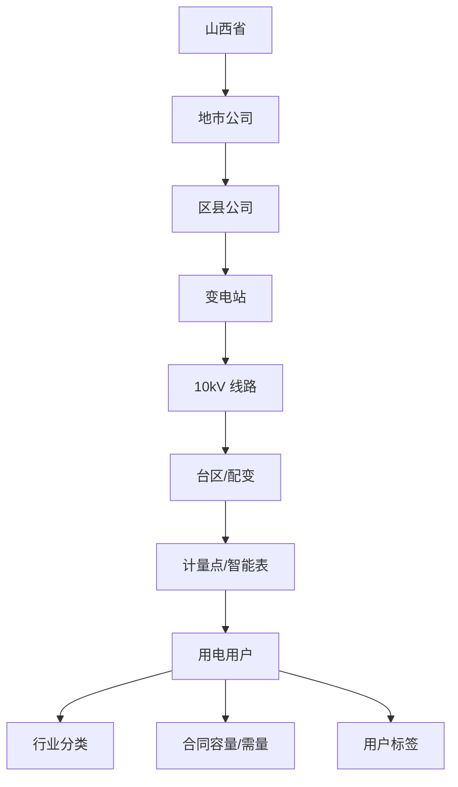
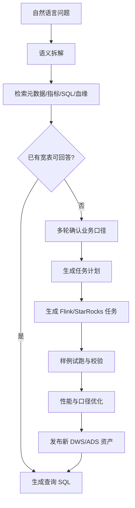
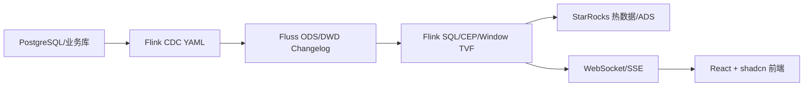
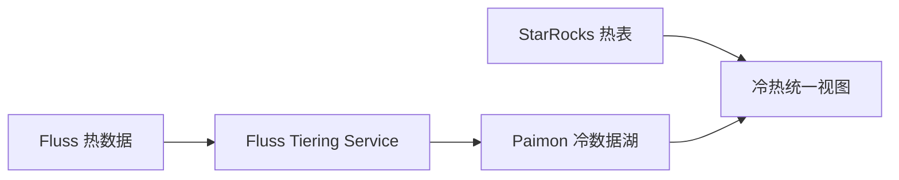

# 山西省全量用电用户实时智能运营平台 - 产品与技术方案 v2

> 文档状态：设计评审版  
> 适用阶段：产品方案、技术架构、前端原型、后续实施计划  
> 核心定位：面向山西省全量用电用户，构建实时监测、智能分析、AI 建任务、流批一体兜底、数据模拟压测一体化平台。

---

## 1. 产品定位

本平台不再以单一“煤改电”专项为主线，而是面向山西省全量用电用户，覆盖居民、一般工商业、大工业、高耗能、农业、充电站、分布式光伏、煤改电等多类客户。

平台目标是把“实时负荷、用户画像、异常风险、AI 问数、AI 建任务、离线快照兜底、数据模拟压测”做成一个完整闭环。它既要像真实国网业务系统一样可用，又要能清楚展示 Flink、Fluss、StarRocks、Paimon、LanceDB/Milvus、Text-to-SQL、Flink CEP、Window TVF、CDC Changelog、流批一体等技术能力。

一句话：

> 山西省全量用电用户实时智能运营平台，是一个面向省、市、县供电公司的“实时数据运营 + AI 数据开发 + 风险处置 + 压测验证”平台。

---

## 2. 用户与角色

| 角色 | 关注点 | 典型操作 |
| --- | --- | --- |
| 省公司运营指挥人员 | 全省负荷态势、重点行业风险、地市排名 | 查看全省态势、一张图下钻、追踪重点风险 |
| 市县公司运维人员 | 本区域异常用户、台区、线路和工单 | 筛选异常、确认告警、派发处置 |
| 大工业客户经理 | 大工业负荷、合同容量、需量、功率因数 | 分析企业负荷曲线、识别异常用电 |
| 数据分析人员 | 指标口径、宽表、查询结果、临时分析 | Text-to-SQL、保存查询、创建分析任务 |
| 数据工程师 | Flink 作业、StarRocks 表、Fluss/Paimon 分层 | 审核 AI 任务、调优任务、处理失败 |
| 测试/演示人员 | 批量数据、实时流、CDC、CEP、升级场景 | 启动模拟数据、生成压测、验证链路 |

---

## 3. 业务对象模型

平台围绕“用户 - 计量点 - 台区 - 线路 - 变电站 - 组织区域”建立全量业务对象。



核心标签包括：

- 用户类型：居民、一般工商业、大工业、农业、充电站、分布式光伏。
- 行业标签：煤炭、焦化、钢铁、铝镁、电解、制造、园区、公共服务。
- 风险标签：重载、过载、三相不平衡、电压异常、负荷突增、功率因数异常。
- 场景标签：迎峰度夏、迎峰度冬、煤改电、停电影响、保供企业。

---

## 4. 核心产品模块

### 4.1 全省实时态势工作台

首页不是单纯大屏，而是一个可操作的运营台。

核心内容：

- 全省当前总负荷、今日峰值、昨日峰值、预测峰值。
- 分地市、分行业、分用户类型负荷排名。
- 当前异常用户数、异常台区数、异常线路数、影响用户数。
- 大工业用户实时负荷 TopN、突增 TopN、功率因数异常 TopN。
- 实时链路健康度：Flink 作业状态、Fluss 延迟、StarRocks 写入延迟、Paimon 分层进度。

交互方式：

- 左侧组织树筛选：省、市、县、变电站、线路、台区。
- 顶部业务筛选：用户类型、行业、风险类型、时间范围。
- 中间一张图：按区域和线路展示风险热力。
- 右侧风险队列：实时告警、预测风险、离线校准差异、工单状态。

### 4.2 全量用户画像与检索

用户画像用于承接 Text-to-SQL 和下钻分析。

字段维度：

- 基础档案：用户编号、用户名称、所属单位、地址、行业、用户类别。
- 计量关系：计量点、电表、台区、线路、变电站。
- 容量信息：合同容量、运行容量、最大需量、功率因数考核方式。
- 负荷特征：日峰谷、月峰谷、负荷率、负荷波动、生产班次特征。
- 风险标签：近期异常次数、连续重载、低功率因数、突增突降、疑似停产复产。
- 数据质量：采集完整率、晚到率、补采率、档案变更次数。

### 4.3 大工业用户专项分析

大工业用户是 v2 的重点场景。它比普通居民用户更能体现实时、批量、AI 和异常检测价值。

核心分析：

- 合同容量与最大需量对比。
- 负荷突增/突降识别。
- 晚高峰负荷贡献排名。
- 行业用电趋势和同比环比。
- 功率因数异常和无功补偿建议。
- 停产、复产、错峰、限产的曲线特征识别。
- 企业群组分析：同园区、同行业、同线路的联动变化。

可配置口径：

- 突增：当前负荷超过昨日同小时 30%，或超过近 7 日均值 2 倍。
- 突降：当前负荷低于近 7 日均值 50%，并持续 30 分钟。
- 需量风险：最大需量接近合同容量阈值。
- 功率因数异常：低于考核阈值并持续多个窗口。

### 4.4 实时异常与 Flink CEP

实时异常分两类：单点阈值异常和链式复杂事件。

单点异常：

- 电压越限。
- 电流越限。
- 负荷率过高。
- 功率因数过低。
- 数据中断或采集延迟。

复杂事件：

- 用户负荷从合理区间连续上升到高风险区间。
- 大工业用户负荷 15 分钟内突增，并带动上游台区重载。
- 同一线路下多个高耗能用户同步启动，触发线路风险。
- 三相不平衡持续扩大。
- 表计档案变更后出现异常突增，需要标记为待校验。

Flink CEP 输入必须使用 append-only 事件流。对于 Fluss/Flink CDC 的 changelog 数据，需要在进入 CEP 前做桥接：

- 主链路保留 changelog，用于统计修正和 StarRocks 主键表。
- CEP 链路抽取 insert/update_after 的最终态事件，或把 delete 转换为带标记的业务事件。
- 对错误补采和档案订正产生的历史告警，交给离线校准任务进行撤回或更正。

### 4.5 Window TVF 实时指标

使用 Flink SQL Window TVF 承接高频统计。

适用指标：

- `TUMBLE`：1 分钟、5 分钟实时窗口负荷。
- `HOP`：滚动观察突增突降趋势。
- `CUMULATE`：从当天 00:00 到当前的累计电量、累计异常次数、峰值追踪。
- 会话类窗口：识别企业连续生产、停产、复产时段。

结果进入 DWS/ADS，并写入 StarRocks 服务前端查询。

---

## 5. Text-to-SQL 与 AI 数据任务 Agent

### 5.1 基本 Text-to-SQL

适用于已有宽表或结果表的查询。

流程：

1. 用户输入自然语言。
2. 检索语义层、表结构、字段说明、指标口径、历史 SQL。
3. 生成 StarRocks SQL。
4. SQL AST 校验，只允许安全查询。
5. 执行 SQL，返回表格、图表和解释。
6. 保存查询历史，反哺检索样本。

示例：

> 查询近 7 天太原大工业用户晚高峰负荷 Top10，并按行业分组。

### 5.2 没有宽表时的 AI 建任务

这是 v2 的关键创新点：当 Text-to-SQL 发现没有合适宽表或结果表，不是直接失败，而是进入多步骤 Agent。



Agent 子模块：

- 规划模块：拆分对象、指标、维度、过滤条件、时间范围。
- 元数据检索模块：检索 DDL、字段描述、指标口径、血缘、历史 SQL。
- 多轮交互模块：缺业务口径时向用户提问。
- 任务生成模块：生成 Flink streaming、Flink batch、StarRocks ADS 表或物化视图。
- 校验模块：执行样例 SQL、检查空值、重复、倾斜、延迟、结果合理性。
- 优化模块：建议主键、分区、并行度、lookup cache、StarRocks 表模型。
- 发布模块：注册新表、新指标、新血缘、新向量样本。

示例：

用户问：

> 分析近 30 天山西大工业用户晚高峰负荷突增，并按行业和地市排名。

如果没有现成宽表，Agent 会提问：

> “突增”建议按昨日同小时环比超过 30%，还是近 7 日均值超过 2 倍？晚高峰按 18:00-22:00 还是可配置时段？

用户确认后，系统生成新任务：

- DWD：用户计量点负荷明细宽表。
- DWS：用户小时负荷与近 7 日基线表。
- ADS：大工业晚高峰突增排名表。
- StarRocks 查询视图：供 Text-to-SQL 和前端复用。

---

## 6. 向量模型、Milvus 与 LanceDB

### 6.1 Embedding 模型选型

MVP 推荐：

- `BGE-M3`：中文友好，支持多语言、多粒度和 dense/sparse/multi-vector 检索，适合表结构、字段说明、业务口径、历史 SQL。
- 搭配 reranker：提升复杂问题的候选表和字段召回质量。

增强选项：

- `Qwen3-Embedding`：支持 0.6B/4B/8B 多规格，适合对比评测和更强语义理解场景。

### 6.2 存储边界

| 组件 | 定位 | 存储内容 |
| --- | --- | --- |
| Milvus | 在线向量检索库 | DDL、字段、指标、SQL 示例、业务口径 embedding |
| LanceDB/Lance | AI 资料湖与训练数据层 | 原始资料、标签、描述、版本、embedding、评测集、Agent 中间产物 |
| StarRocks | 结构化实时分析 | DWS/ADS 结果表、查询视图、看板数据 |
| Fluss | 实时变更流湖仓 | ODS/DWD/DWS/ADS changelog、热流数据 |
| Paimon | 离线历史湖仓 | 冷数据、快照、batch 校准数据 |

### 6.3 LanceDB 的产品价值

LanceDB 不只是“另一个向量库”。它更适合作为 AI 数据资产管理层。

它负责：

- 保存原始业务文档、Excel 功能点、字段口径、接口文档。
- 保存每次 embedding 的模型版本、切片策略、标签、来源。
- 保存 Text-to-SQL 的问题、候选表、最终 SQL、执行结果、用户反馈。
- 保存 AI 建任务过程中的计划、试跑结果、优化建议。
- 保存评测集，用于比较 BGE-M3、Qwen3-Embedding、reranker 的效果。
- 支持版本化，让语义层和训练样本可以回溯。

Milvus 负责高并发在线检索，LanceDB 负责资料治理、版本和训练/评测闭环。

---

## 7. 流批一体与离线兜底

### 7.1 实时链路



实时链路用于秒级看板、异常告警和 AI 查询。

### 7.2 自动分层



热数据进入 StarRocks，历史数据通过 Fluss Tiering Service 进入 Paimon。StarRocks 统一视图对外屏蔽冷热差异。

### 7.3 离线 batch 兜底

实时链路可能遇到乱序、补采、任务重启、schema 变更、CEP 不支持 retraction 等问题。离线 batch 用于兜底和校准。

离线任务：

- 每小时或每天从 Paimon 快照跑 Flink batch。
- 生成离线 DWS/ADS 基准表。
- 对比实时 ADS 结果，输出差异表。
- 修正错误告警、错误排名、错误累计值。
- 当实时接口异常时，前端可切换到离线接口。

产品表现：

- 看板上显示“实时数据”和“离线校准数据”的一致性。
- 风险详情页显示该告警是否已被离线任务确认。
- AI 查询可选择实时口径或离线校准口径。

---

## 8. 数据场景模拟与压测中心

这是 v2 的重要产品模块，既服务演示，也服务技术验证。

### 8.1 模拟对象

- 省、市、县组织结构。
- 变电站、线路、台区、计量点。
- 居民、工商业、大工业、高耗能、农业、充电站、分布式光伏用户。
- 合同容量、运行容量、行业、标签。
- 电压、电流、有功、无功、电量、功率因数。

### 8.2 模拟场景

| 场景 | 用途 |
| --- | --- |
| 批量基础档案 | 验证大规模用户画像和检索 |
| 实时遥测流 | 验证 Flink/Fluss/StarRocks 实时链路 |
| 大工业突增 | 验证异常检测和 AI 分析 |
| 三相不平衡 | 验证 CEP 与窗口统计 |
| CDC 更新删除 | 验证 changelog、retraction、主键表 |
| 晚到与补采 | 验证水位线、离线校准 |
| 升级中双写 | 验证新旧任务对账 |
| 海量压测 | 验证吞吐、延迟、查询并发 |
| AI 建任务样例 | 验证无宽表到新任务发布的闭环 |

### 8.3 前端交互

模拟中心使用 shadcn 表单和步骤条：

- 选择业务场景。
- 设置用户规模、采集频率、异常比例、持续时间。
- 选择写入目标：Postgres 源表、Fluss 表、模拟 API。
- 启动任务并查看实时进度。
- 查看 Flink 延迟、StarRocks 写入量、告警数量、查询耗时。
- 一键生成“升级中场景”：旧任务继续跑，新任务灰度跑，生成对账报告。

---

## 9. 前端产品结构

技术栈建议：React + TypeScript + shadcn/ui + TanStack Query + ECharts/Recharts + Monaco Editor。

### 9.1 页面导航

1. 全省态势
2. 用户画像
3. 大工业分析
4. 实时风险
5. AI 问数
6. AI 建任务
7. 数据任务中心
8. 模拟数据与压测
9. 系统运行监控

### 9.2 关键页面

#### 全省态势

- 顶部 KPI：总负荷、峰值、异常、工单、链路延迟。
- 中间地图：山西地市热力、线路和台区风险。
- 右侧队列：实时异常、预测风险、离线差异。
- 底部曲线：今日、昨日、预测、离线校准四条曲线。

#### AI 问数

- 左侧聊天。
- 中间 SQL/图表/表格结果。
- 右侧检索证据：命中的表、字段、指标、历史 SQL。
- 安全提示：执行前展示 SQL AST 校验结果。

#### AI 建任务

- 步骤条：语义拆解、元数据检索、口径确认、任务生成、试跑、优化、发布。
- 每一步都可查看 Agent 思考摘要、候选表、SQL、执行计划。
- 用户可以修改口径，Agent 重新生成。

#### 模拟数据与压测

- 场景模板卡片。
- 参数配置面板。
- 实时吞吐和延迟图。
- 异常注入开关。
- 压测报告。

---

## 10. 部署形态

### 10.1 第一阶段：Docker Compose 主路径

第一阶段继续使用纯 Docker Compose。

原因：

- 当前 `startup.sh` 已经沉淀大量启动和避坑逻辑。
- 本地演示稳定性高。
- Flink、Fluss、StarRocks、Paimon、Postgres、前端服务可以一次性拉起。
- 适合快速验证产品闭环和 AI 建任务。

第一阶段服务：

- `postgres`
- `fluss`
- `flink-jobmanager`
- `flink-taskmanager`
- `flink-cdc-cli`
- `starrocks`
- `rustfs` 或 S3 兼容存储
- `milvus`
- `lancedb-service`
- `api-server`
- `agent-service`
- `simulator`
- `frontend`

`startup.sh` 建议继续保留 clean/warm 两种模式：

- clean：清空状态，适合演示重置。
- warm：保留数据，适合迭代调试。

### 10.2 第二阶段：Docker Desktop Kubernetes / kind 增强版

第二阶段加入 K8s-ready 版本，但不替代 Docker Compose 主路径。

目标：

- 展示云原生部署能力。
- 展示 Flink batch CronJob、模拟数据 Job、前后端 Deployment。
- 保留本机可运行，不依赖真实云集群。

建议目录：

```text
deploy/
  compose/
  k8s/
    base/
    overlays/
      docker-desktop/
      kind/
```

K8s 映射：

| 组件 | K8s 资源 |
| --- | --- |
| frontend | Deployment + Service |
| api-server | Deployment + Service |
| agent-service | Deployment + Service |
| simulator | Job/CronJob |
| offline-batch | CronJob |
| flink-jobmanager | Deployment/Service |
| flink-taskmanager | Deployment |
| starrocks | StatefulSet |
| fluss | StatefulSet |
| milvus | StatefulSet/Helm |
| lancedb-service | Deployment/StatefulSet |
| postgres | StatefulSet |
| rustfs/minio | StatefulSet |

本机 K8s 选择：

- Docker Desktop Kubernetes：适合快速打开内置 K8s，演示 Deployment/Service/CronJob。
- kind：适合脚本化创建集群，也更利于团队复现。

建议实现策略：

1. 默认仍使用 Docker Compose。
2. 提供 `make kind-up` 或脚本创建 kind 集群。
3. K8s 只先迁移无状态服务、模拟器和离线 batch。
4. StarRocks、Fluss、Milvus 等状态服务可先沿用 Compose，K8s 通过 NodePort/host 访问。
5. 第二轮再尝试状态服务 K8s 化，避免一次性复杂度过高。

---

## 11. 技术能力映射

| 技术点 | 产品体现 |
| --- | --- |
| Text-to-SQL | AI 问数，生成安全 StarRocks SQL |
| ReAct/Plan Agent | 没有宽表时多轮创建数据任务 |
| BGE-M3/Qwen3-Embedding | 元数据、指标、SQL、文档语义检索 |
| Milvus | 在线向量检索 |
| LanceDB/Lance | AI 资料湖、版本、训练样本、评测集 |
| Flink CDC YAML | 源表进入 Fluss 的数据接入 |
| Fluss | 实时 changelog 湖仓与分层 |
| Fluss Tiering | 自动归档到 Paimon |
| Paimon | 历史冷数据和离线快照 |
| StarRocks | 高并发实时分析和统一冷热查询 |
| Window TVF | 实时窗口、累计窗口、峰值追踪 |
| Flink CEP | 链式复杂事件识别 |
| Retraction 处理 | CDC 更新删除修正、CEP append-only 桥接 |
| Flink batch | 离线校准和兜底接口 |
| Docker Compose | 第一阶段本地全链路演示 |
| Docker Desktop K8s/kind | 第二阶段云原生增强演示 |
| 数据模拟器 | 大批量、CDC、CEP、升级中、压测验证 |

---

## 12. 非功能目标

| 维度 | 目标 |
| --- | --- |
| 实时延迟 | 核心异常端到端 3-5 秒内展示 |
| 查询延迟 | StarRocks 热数据常用查询 p95 小于 1 秒 |
| 数据规模 | 演示版支持百万级用户档案、千万级遥测模拟 |
| 可靠性 | 实时失败时可切换离线快照接口 |
| 可解释性 | AI 查询必须展示命中表、字段、指标和 SQL |
| 安全性 | Text-to-SQL 只允许只读查询，限制行数和敏感字段 |
| 可演示性 | 一键 clean/warm 启动，一键模拟异常和压测 |
| 可迁移性 | Compose 主路径，K8s-ready 第二阶段 |

---

## 13. MVP 范围

### 必做

- 全省态势首页。
- 用户画像检索。
- 大工业用户专项分析。
- 实时风险队列。
- Text-to-SQL 基础问数。
- AI 建任务流程原型。
- BGE-M3 + Milvus 元数据检索。
- LanceDB AI 资料湖设计与最小落地。
- Fluss + Paimon 自动分层。
- StarRocks 热表和统一查询视图。
- Flink batch 离线校准任务。
- 数据模拟与压测中心。
- Docker Compose 一键启动。

### 第二阶段

- Docker Desktop Kubernetes / kind 部署。
- offline-batch CronJob。
- simulator Job/CronJob。
- API/frontend/agent-service K8s 化。
- 部分状态服务 K8s 化验证。
- AI 建任务发布到真实 Flink SQL 作业。

### 暂缓

- 完整生产级权限体系。
- 真实国网接口对接。
- 复杂移动端工单 App。
- 全量状态服务生产级 K8s 高可用。
- 多模型自动训练平台。

---

## 14. 关键风险与对策

| 风险 | 对策 |
| --- | --- |
| 产品范围过大 | MVP 聚焦全省态势、大工业、AI 问数、AI 建任务、模拟压测 |
| AI 生成任务不稳定 | 必须有人机确认、试跑、SQL 校验、发布审核 |
| CEP 不支持 retract | CEP 使用 append-only 桥接，修正交给离线校准 |
| K8s 本地复杂度高 | Compose 为主路径，K8s 做第二阶段增强 |
| 向量检索命中差 | BGE-M3 + reranker，保留 Qwen3-Embedding 评测通道 |
| LanceDB 与 Milvus 边界混乱 | Milvus 做在线检索，LanceDB 做 AI 资料湖和版本治理 |
| 大数据模拟压垮本机 | 预设小/中/大三档压测模板，逐步提升规模 |

---

## 15. 下一步实施拆分建议

1. 梳理当前 `startup.sh`，拆出可复用的 Compose 服务边界。
2. 设计数据模型：用户档案、计量点、负荷遥测、大工业合同、异常事件、AI 任务。
3. 实现模拟数据生成器，先支持批量档案和实时遥测。
4. 建立 StarRocks DWS/ADS 表和统一视图。
5. 搭建 Text-to-SQL 元数据检索：BGE-M3 + Milvus。
6. 接入 LanceDB，保存文档、SQL、任务计划和评测样本。
7. 实现 AI 建任务原型，先生成任务计划和 SQL，不直接自动发布。
8. 做 shadcn 前端：全省态势、AI 问数、AI 建任务、模拟压测。
9. 增加 Flink batch 离线校准。
10. 第二阶段补充 `deploy/k8s` 与 kind/Docker Desktop K8s 演示。

---

## 16. Implementation Plan

The approved implementation plan is saved at:

`docs/superpowers/plans/2026-07-07-shanxi-user-ops-platform.md`
