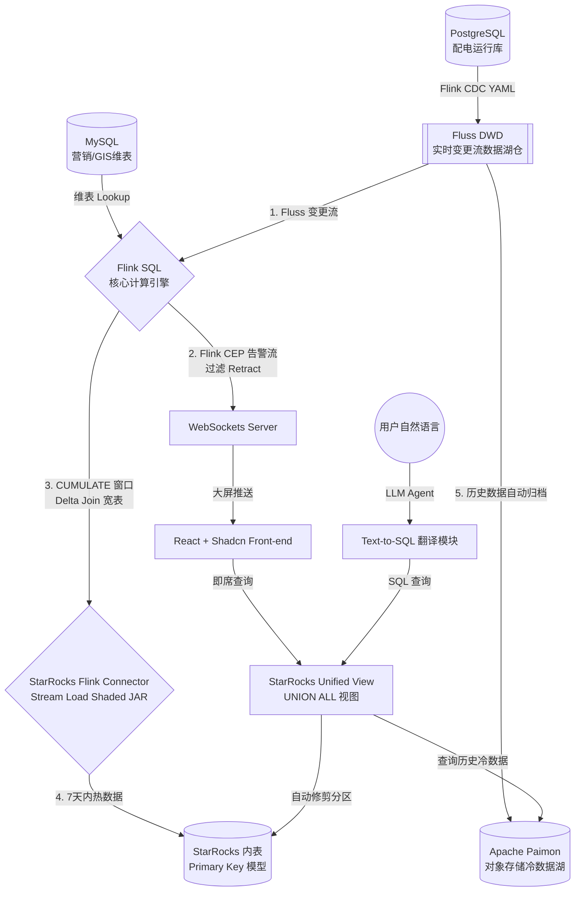

# 国家电网配变与线路状态实时监测平台——技术架构设计说明书

> **文档状态**：发布版 (v1.0.0)  
> **面向对象**：核心架构师、大数据工程师、运维开发人员  
> **核心目标**：提供电网实时监控底座的端到端技术链路图，攻克 Retraction 流与 CEP/JDBC Sink 的冲突，并给出 Flink SQL 与编译坑点规避指南。

---

## 一、 系统技术拓扑架构

本平台采用基于 **Flink + Fluss + StarRocks + Paimon** 的实时湖仓一体化方案，替代传统繁琐的 Kafka + ClickHouse 架构。



---

## 二、 核心技术栈选型与原理解析

### 1. Fluss：新一代变更流与数据湖仓 (Fluss Storage)
*   **定位**：Fluss 充当类似于 Kafka 的高吞吐实时流，且天生具备保存 Changelog（变更日志，包含 INSERT/UPDATE/DELETE）的能力。
*   **优势**：在 Flink SQL 中作为 DWD 层时，Fluss 可以作为 Retraction 流的源头，并支持秒级向 Apache Paimon 归档冷数据。

### 2. StarRocks：极速冷热分析引擎 (StarRocks Engine)
*   **热数据 (7天内)**：采用 StarRocks **主键模型表 (Primary Key)**，保证以极高吞吐量进行 Upsert/Delete 写入，保障秒级大屏统计。
*   **冷数据 (7天后)**：存放在 **Apache Paimon** 外表中。
*   **冷热融合查询**：建立 StarRocks **统一视图 (Unified View)**，编写 `UNION ALL` 逻辑，对外只暴露一个视图。StarRocks 支持外表的分区修剪，查询 7 天内数据时**绝对不会**去扫描冷数据库 Paimon，从而保证零性能损耗。

---

## 三、 Flink Retraction 流的核心冲突与终极解决方案

### 1. 痛点分析
*   **Flink CEP 的局限**：Flink SQL 中的 `MATCH_RECOGNIZE`（CEP 算子）仅支持 **Append-Only（仅追加）** 的输入流。如果 Fluss / Flink CDC 产生的 Changelog 包含 `UPDATE_BEFORE` 或 `DELETE` 记录，Flink 在执行时会直接报错崩溃：
    `org.apache.flink.table.api.TableException: Retraction stream is not supported by MATCH_RECOGNIZE.`
*   **JDBC Sink 的缺陷**：如果使用常规的 Flink JDBC Connector 写入 StarRocks 主键表，由于 JDBC 针对主键表会转译为 MySQL 特有的 `INSERT ... ON DUPLICATE KEY UPDATE` 语法，StarRocks 解析器无法识别，直接导致同步作业失败。

---

### 2. 终极解决方案

#### 方案 A：针对 Flink CEP 告警流的过滤转换
在将数据送入 CEP 算子之前，利用 Fluss 的内置属性 `$changelog_op` (即 Flink SQL 的 `op` / `op_type` 隐藏列) 对 Retraction 流进行过滤，只提取物理插入和更新后的状态 (`INSERT` / `UPDATE_AFTER`)。此举相当于把流“欺骗”并转换为了 Insert-Only 格式。

**Flink SQL 实现示例**：
```sql
-- 1. 从 Fluss 变更表中过滤出单向追加态的视图
CREATE VIEW dwd_meter_readings_insert_only AS
SELECT 
    meter_id, 
    ua_curr, 
    op_time,
    status
FROM dwd_meter_readings
-- Fluss 通过隐藏系统列或 op 判断，只保留正向变动，过滤掉 RETRACT (UPDATE_BEFORE 和 DELETE)
WHERE op = 'I' OR op = 'UA'; -- I: INSERT, UA: UPDATE_AFTER

-- 2. 将此视图作为 MATCH_RECOGNIZE (CEP) 的数据源
CREATE VIEW cep_heavy_overload_alerts AS
SELECT *
FROM dwd_meter_readings_insert_only
MATCH_RECOGNIZE (
    PARTITION BY meter_id
    ORDER BY op_time
    MEASURES
        FIRST(A.op_time) AS start_time,
        LAST(C.op_time) AS alert_time,
        LAST(C.ua_curr) AS current_val
    ONE ROW PER MATCH
    AFTER MATCH SKIP PAST LAST ROW
    PATTERN (A B+ C)
    DEFINE
        A AS A.status = 'REASONABLE',
        B AS B.status = 'HEAVY' AND B.op_time - A.op_time <= INTERVAL '15' MINUTE,
        C AS C.status = 'OVERLOAD'
);
```

#### 方案 B：使用 StarRocks 官方 Flink Connector
针对 StarRocks 的写入，**彻底抛弃 JDBC Sink**，采用官方自研的 `starrocks-flink-connector`，利用其内置的 Stream Load 接口和 shaded 的依赖包写入。
*   官方连接器能够自动根据 Fluss 变更流中的 row kind（`+I`, `-U`, `+U`, `-D`）在后台映射为 Stream Load 的 `UPSERT` 和 `DELETE` 标记，支持撤回流完美写入 StarRocks 主键表。

---

## 四、 核心 Flink SQL 管道设计

### 1. 设备元数据动态维表 Join (Lookup Temporal Join)
流式电网遥测数据需要与营销/GIS变压器静态信息（保存在 PostgreSQL 中）进行关联，以展示变压器所属区县。

```sql
CREATE TABLE mysql_dim_transformer (
    transformer_id VARCHAR,
    district_name VARCHAR,
    capacity DOUBLE,
    PRIMARY KEY (transformer_id) NOT ENFORCED
) WITH (
    'connector' = 'jdbc',
    'url' = 'jdbc:mysql://localhost:3306/stategrid_metadata',
    'table-name' = 'dim_transformer',
    'lookup.cache.max-rows' = '5000',
    'lookup.cache.ttl' = '10 min' -- 缓存 10 分钟以降低维表库压力
);

-- 执行 lookup join 生产宽表
CREATE VIEW dwd_meter_readings_joined AS
SELECT 
    r.meter_id,
    r.ua_curr,
    r.op_time,
    r.status,
    t.district_name,
    t.capacity
FROM dwd_meter_readings AS r
LEFT JOIN mysql_dim_transformer FOR SYSTEM_TIME AS OF r.proctime AS t
ON r.transformer_id = t.transformer_id;
```

### 2. 累计窗口与 Delta Join (CUMULATE Window TVF)
利用 Flink SQL 累计窗口 (CUMULATE)，可以实时统计当天从 00:00 开始到当前各阶段的累计过载次数，并支持撤回修正。

```sql
CREATE VIEW real_time_cumulate_stats AS
SELECT 
    window_start, 
    window_end, 
    district_name,
    COUNT(DISTINCT meter_id) AS total_meters,
    -- 实时过载配变总数
    COUNT(CASE WHEN status = 'OVERLOAD' THEN 1 END) AS overload_meters_count
FROM TABLE(
    CUMULATE(
        TABLE dwd_meter_readings_joined, 
        DESCRIPTOR(op_time), 
        INTERVAL '10' MINUTE, -- 10分钟步长更新一次大屏
        INTERVAL '1' DAY      -- 每天 00:00 重置累计区间
    )
)
GROUP BY window_start, window_end, district_name;
```

---

## 五、 Text-to-SQL 智能运维管道流

为保障大语言模型生成的 SQL 能在 StarRocks 安全高效运行，架构设计如下：

```
[用户输入自然语言] 
      │
      ▼
[LLM (Google Gemini API via Firebase AI Logic)]
      │ (Prompt 中加入 StarRocks DDL Schema 和示例 SQL)
      ▼
[生成的 StarRocks SQL] 
      │
      ▼
[SQL AST Parser (校验 & 脱敏)] 
      │ (仅允许 SELECT 语句，限制最多返回 1000 行)
      ▼
[StarRocks 视图 (UNION ALL)] 
      │
      ▼
[前端组件 (Shadcn Table / Recharts)]
```

---

## 六、 避坑指南：编译与部署注意事项

在将此架构落地到物理环境中时，必须重点注意以下编译及运行坑点：

### 1. Flink 2.2.0 Connector 依赖冲突与编译
*   **依赖范围**：在 `starrocks-connector` 的 `pom.xml` 中，务必将 `flink-core` 和 `flink-streaming-java` 设置为 `<scope>provided</scope>`，否则打出来的 Shaded JAR 会污染 Flink 环境变量。
*   **本地 SDK 优先安装**：`starrocks-connector` 依赖的 `starrocks-stream-load-sdk` 是 SNAPSHOT 内部版本。在根目录运行 `mvn clean install` 之前，**必须先进入 `starrocks-stream-load-sdk` 目录执行 `mvn clean install`**，将其打入本地 `.m2` 仓库，否则根目录编译会因为找不到本地依赖而崩溃。
*   **RAT 插件扫描失效**：如果在编译时将 `.m2` 挂载在项目根目录下以提高构建缓存效率，务必在命令中加上 **`-Drat.skip=true`**。否则 Apache RAT 插件会扫描 `.m2` 下千万个无 License 标示的 POM 文件，直接阻断编译并抛出 License 缺失错误。

### 2. StarRocks 外表 Paimon 自动修剪与分区对齐
*   **分区格式**：Paimon 存储的冷数据分区字段格式必须与 StarRocks 视图的分区物理字段对齐（建议按日期 `dt VARCHAR` 分区）。
*   **视图优化**：编写 UNION ALL 视图时，一定要包含 `dt` 条件，格式如下：
    ```sql
    CREATE VIEW v_unified_meter_readings AS
    SELECT * FROM sr_inner_meter_readings WHERE op_time >= DATE_SUB(NOW(), INTERVAL 7 DAY)
    UNION ALL
    SELECT * FROM sr_paimon_external_meter_readings WHERE dt < DATE_FORMAT(DATE_SUB(NOW(), INTERVAL 7 DAY), '%Y-%m-%d');
    ```
    此段代码确保 StarRocks 的优化器在进行近7天数据查询时，直接忽略 `Paimon` 扫描，降低网络 I/O 损耗。

---
